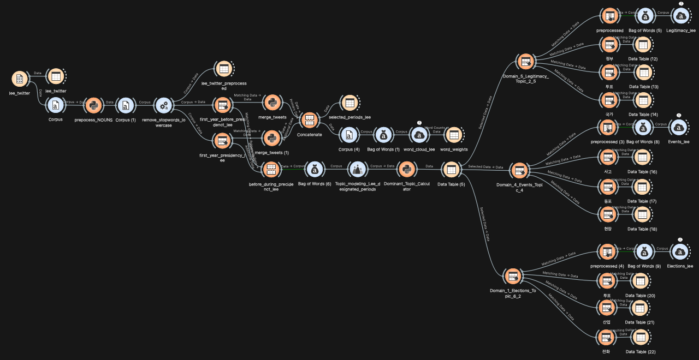

# Orange Data Mining Workflow

The Text analysis is done with a tool called Orange Data Mining. Included here is a scheme which can be important in Orange to do the Analysis yourself and build upon it.

The OWS needs the following files to work:
- [Lee Corpus](../lee_twitter/)
- [Moon Corpus](https://github.com/scdenney/nlp_corpora/tree/main/data/moon_twitter)
- [Stopword list](https://github.com/scdenney/ba3_text_as_data/blob/main/data/stopwords_ko_ba3.txt)

